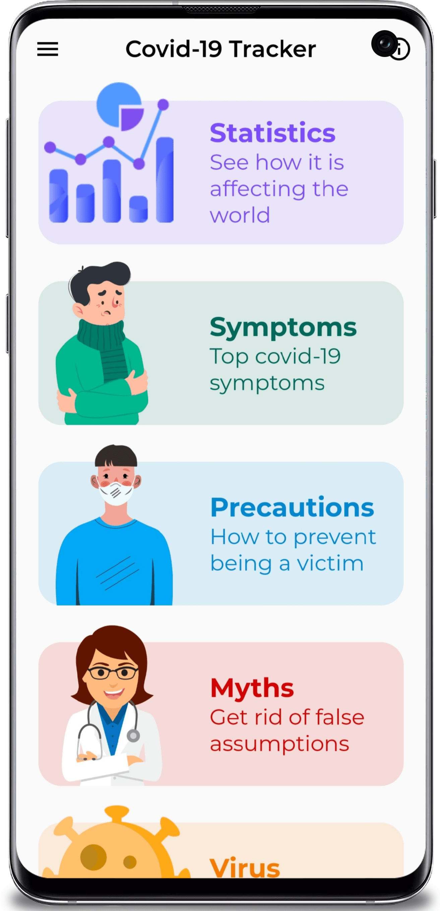
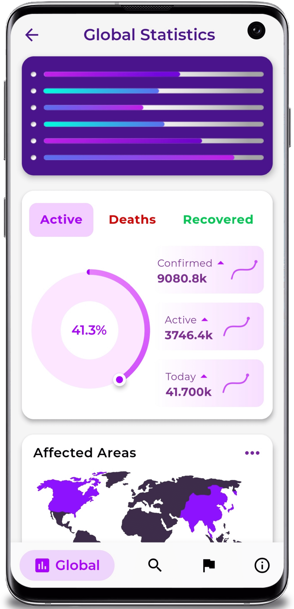
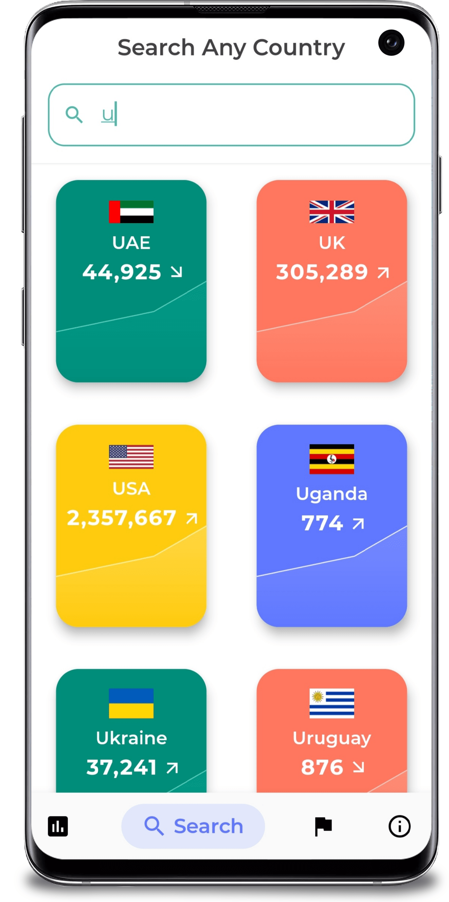
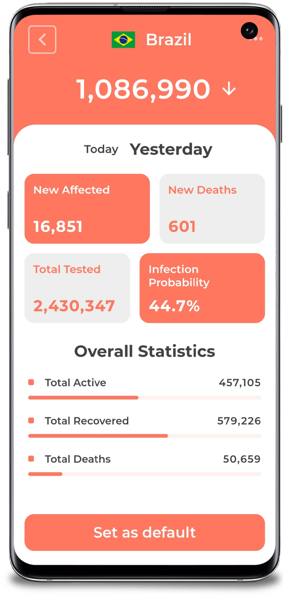
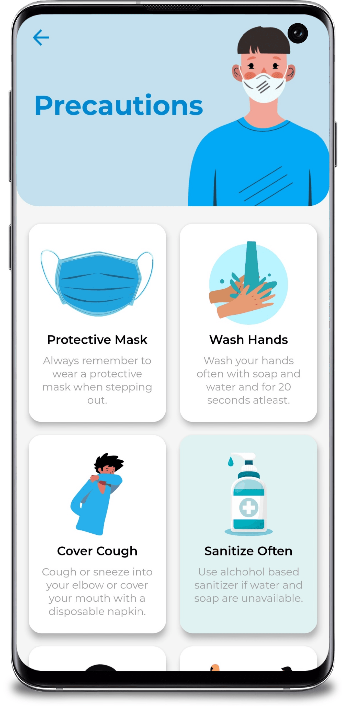

# Covid Tracker - A covid-19 statistics app

        

Covid Tracker is an app made with **Flutter** framework to provide worldwide information related to Covid-19 pandemic. The api used for the data can be found [here](https://corona.lmao.ninja/docs/). **The release apk is available under the release tags. It's also available on this drive link - [Covid Tracker APK](https://drive.google.com/drive/folders/1xazOX_VaaAPzuccusj-hk0zsPZaomDLc?usp=sharing)**

## :iphone: Features

  - Global case count.
  - Case, death and recovery count of each country
  - Total tests and infection probability of each country
  - News updates related to vaccine developement
  - Info, symptoms, precautions and myths of the virus
  - Setting a default country

The UI is inspired by [Dribbble](https://dribbble.com/shots/10847147-Coronavirus-Covid-19-Dashboard)

<kbd></kbd>

  

&nbsp;&nbsp;&nbsp;  
&nbsp;  
&nbsp;&nbsp;&nbsp;

## ⭐ Future Features

  - Drawer for easier navigation
  - Onboarding screens
  - Login authentication using Firebase
  - Maps API to detect nearby danger spots

